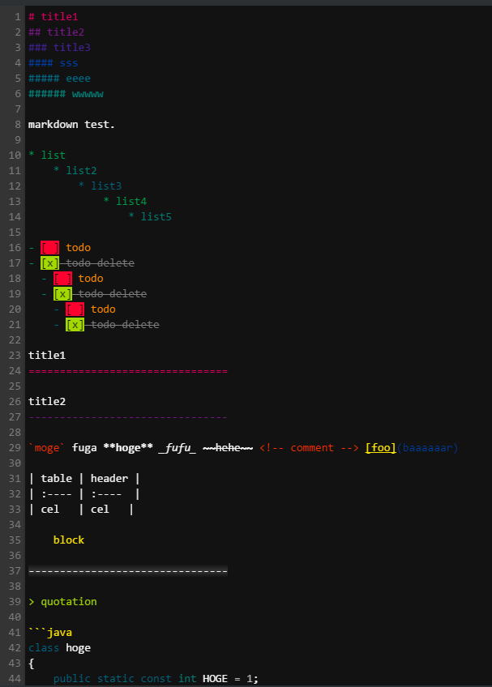

# codemirror-color-themes

boostNoteのカラーテーマです。
markdownを気持ちよく書くために色分けしています。

## 使い方

* `C:\Users\**ユーザー名**\AppData\Local\boost\app-0.8.11\resources\app\node_modules\codemirror\theme`に好きなCSSを放り込んで、BoostNoteを再起動します。
* 設定からテーマを反映させます。

## サンプル

